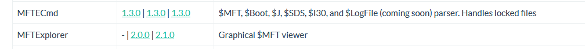
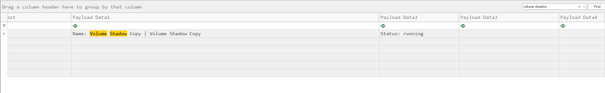
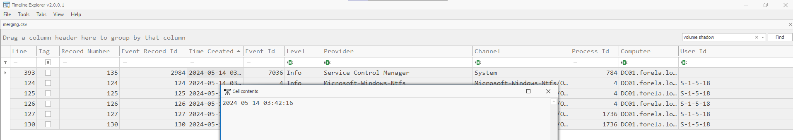
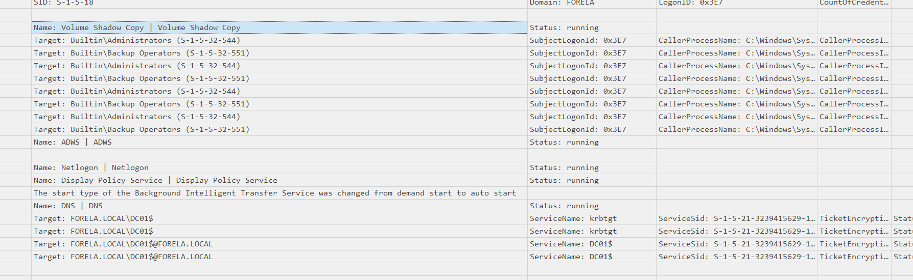
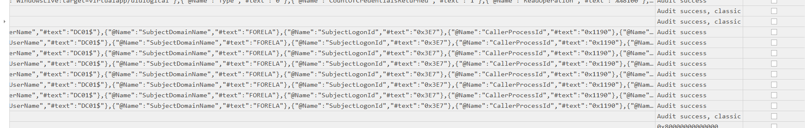
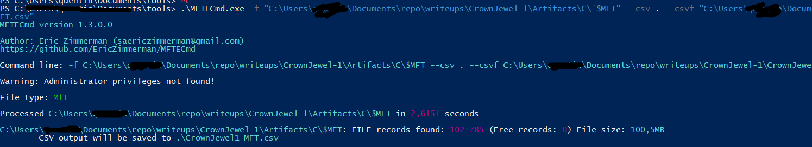
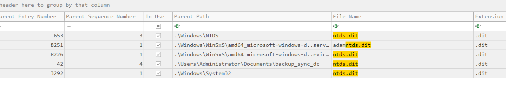
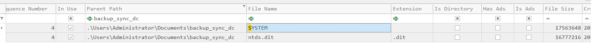

# CrownJewel-1 HTB Writeup
=
In this challenge, we investigate a suspected compromise of a **Domain Controller (DC)**. The goal is to identify traces left by the attacker, who allegedly accessed the `NTDS.dit` database and leveraged Windows tools to exfiltrate data.

## Summary


We are informed that:
- A **Domain Administrator** account was likely compromised.
- The **NTDS.dit** database was dumped.
- The attacker abused **vssadmin** (a known LOLBIN) to create a shadow copy of the volume.

Several forensic artifacts are provided, including Windows Event Logs and `$MFT`.

---

## 🗂️ Step 1 – Download and Extract

```bash
wget [link-to-file]
```

Password: `hacktheblue`

There’s no README included, so we proceed directly to analysis.

---

## Step 2: Provided Files

- `Microsoft-Windows-Ntfs.evtx`
- `Security.evtx`
- `System.evtx`
- `$MFT` (inside a `C\` directory)

---

### checking on internet $MFT

https://www.youtube.com/watch?v=h8Mb55ox5OE

This vidéo teaches me that $MFT contains NTFS data storage (it stores everyhting as a file). it contains inforamtions and metadatas about every file on the volume (location, memory, creation modification deletion..)



but for now we will work with the evtx files since we previously worked with in latest sherlock (SmartyPants)
---

## Step 3: Analyzing `.evtx`

We use **EvtxECmd** to convert all `.evtx` files into a consolidated CSV file, which we’ll explore with **Timeline Explorer** (like we did on smartypants)

```bash
EvtxECmd.exe -d "path-to-folder" --csv "path-to-output" --csvf merging.csv
```

### 🧩 Analysis

By searching for `vssadmin`, we identify the moment a **Volume Shadow Copy** was created — a clear indication of preparation to access locked files like `NTDS.dit`.




Once the shadow copy creation is timestamped, we filter for all related events that occurred shortly after. This gives us insight into the attack timeline.



:Administrators, Backup Operators, DC01$



scroll right till you find the process id 0x1190 then convert to decimal : 4496
https://www.rapidtables.com/convert/number/hex-to-decimal.html?x=1190

by scrolling and filtering + elimination we find
{06c4a997-cca8-11ed-a90f-000c295644f9}

Now let's turn $MFT into something readable

```bash
MFTECmd.exe -f "C:\...\$MFT" --csv . --csvf MFT.csv
```



We then import the CSV into **Timeline Explorer**.
(I tried mftexplorer but didn't find anything relevant)


### 📁 Tracking the NTDS.dit Dump

By filtering for `ntds.dit`, we identify the file path used by the attacker:

```
C:\Users\Administrator\Documents\backup_sync_Dc\Ntds.dit
```



task 6
(on same line, just scroll right)

### 📂 Finding Related Files

Assuming the attacker staged other files in the same directory, we filter by path and discover files including:



- `SYSTEM` dump
- Total file size: ~17 MB (`17563648` bytes)

SYSTEM, 17563648


## Final Notes

This challenge highlights several critical points:

- Shadow Copy (`vssadmin`) abuse is a common technique to access locked files like `ntds.dit`.
- Monitoring Event Logs is crucial for detecting privilege escalation and shadow copy creation.
- `$MFT` is a powerful forensic artifact to trace file-level actions post-compromise.
- Standard tools (EvtxECmd, MFTECmd, Timeline Explorer) are essential for structured log review.
- Limiting privileged account use and detecting anomalous activity from built-in tools (LOLBINs) is vital.

