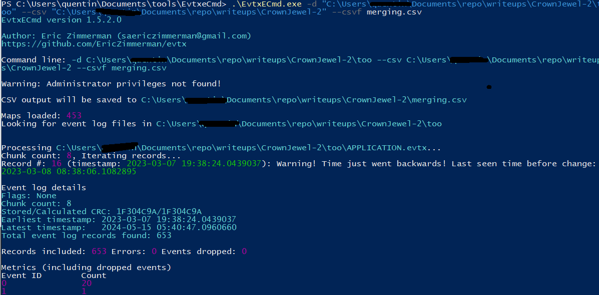
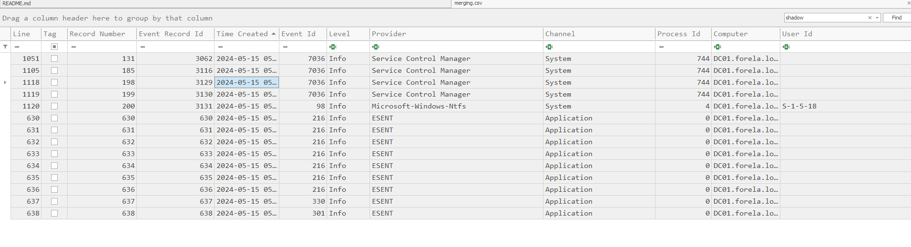
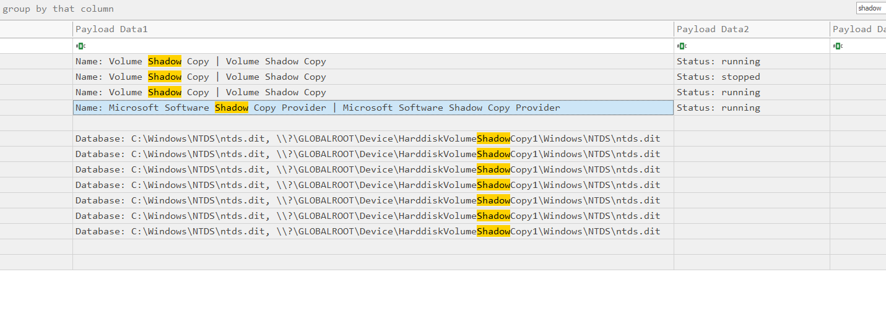
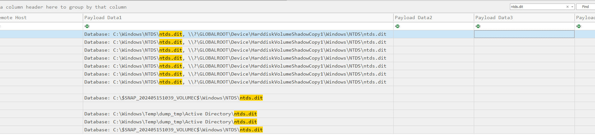
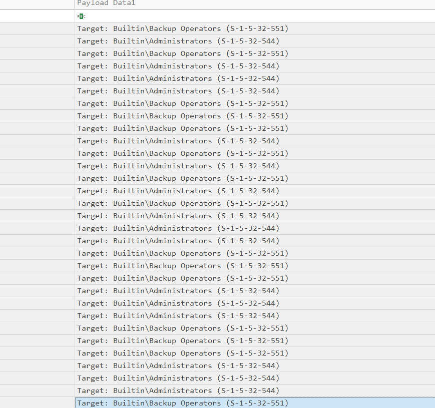
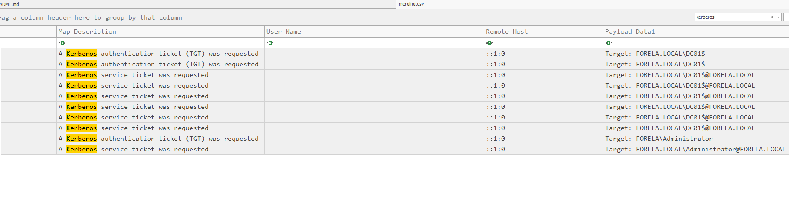

# CrownJewel-2 HTB Writeup

## Summary
In the continuity of CrownJewel-1 we get told that we received another alert from DC NTDS.dit db exfiltrated.
(NTDS.dit was dumped by vssadmin utility.) After kicking the attacker, someone managed to get persistent access through ntdsutil.


---

## 🗂️ Step 1 – Download and Extract

```bash
wget [link-to-file]
```

Password: `hacktheblue`

There’s no README included, so we proceed directly to analysis.

---

## Step 2: Provided Files

- `APPLICATION.evtx`
- `SECYRUTY.evtx`
- `SYSTEM.evtx`

---

we are getting used to evtxfiles.

---

## Step 3: Analyzing `.evtx`

We use **EvtxECmd** to convert all `.evtx` files into a consolidated CSV file, which we’ll explore with **Timeline Explorer**

```bash
.\EvtxECmd.exe -d "path-to-folder" --csv "path-to-output" --csvf merging.csv
```



### 🧩 Analysis

##### T1 : When utilizing ntdsutil.exe to dump NTDS on disk, it simultaneously employs the Microsoft Shadow Copy Service. What is the most recent timestamp at which this service entered the running state, signifying the possible initiation of the NTDS dumping process?

filtering through "shadow copy service" we find several output. to find the one we need. scroll right and check for microsoft software.




timestamp : 2024-05-15 05:39:55

###### T2 : Identify the full path of the dumped NTDS file.

filter through "ntds.dit"



path : C:\Windows\Temp\dump_tmp\Active Directory\ntds.dit

###### T3 : When was the database dump created on the disk?

scroll left to get timestamp

timestamp : 2024-05-15 05:39:56

###### T4 : When was the newly dumped database considered complete and ready for use?

From screen 3, check when the database was detached

timestamp : 2024-05-15 05:39:58

###### T5 : Event logs use event sources to track events coming from different sources. Which event source provides database status data like creation and detachment?

on the same line. get value from the provider. (We can't get wrong since every row value contains the same information)

provider : ESENT

###### T6 : When ntdsutil.exe is used to dump the database, it enumerates certain user groups to validate the privileges of the account being used. Which two groups are enumerated by the ntdsutil.exe process? Give the groups in alphabetical order joined by comma space.

Filter through ntdsutil.exe



On top of all of thoses occurences. two group name stands out.

groups : Administrators, Backup Operators

##### T6 : Now you are tasked to find the Login Time for the malicious Session. Using the Logon ID, find the Time when the user logon session started.

filter through kerberos and check for login 


get the timestamp from that session 

timestamp : 2024-05-15 05:36:31
