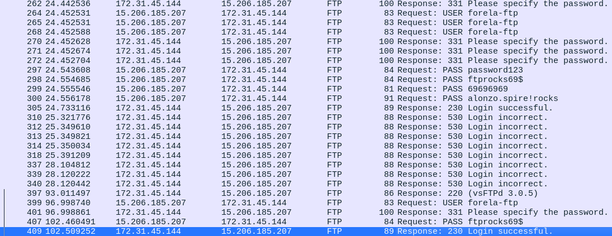

# Origins HTB Writeup

In this challenge, we know that  
an attacker accessed internal data. To lead investigations, a PCAP file is provided. 

## Summary

We are informed that:
- 20GB of data were stolen from S3 buckets (internal).
- An FTP server was suspected to be the source of the attack.
- A PCAP file is given for deeper research.

---

## Step 1: Download and Unpack

Download the provided archive:

```
wget [link-to-the-file]
```

Password: `hacktheblue`

Note: There is no README file inside, so we move directly to log analysis.

---

## Step 2: Provided Files

- **ftp.pcap** → pcap files are related to wireshark analysis.
it is captured data about traffic over the network.

Ftp data transit through port 20/21

---

## Step 3: Analyzing `ftp.pcap`

A first analysis we could do is to filter FTP over the network.  
We get this first overview!  


The first thing we recognize here is that IP `15.206.185.207` connects to `172.31.45.144` repeatedly  
with `USER` commands, aiming to brute-force account names on the FTP server based on the return status (response).


As we can see, if a positive response appears, it means that the account exists for login (common FTP brute-force attack).  
We discover that FTP allows:

- admin
- svcaccount
- ftpuser
- forela-ftp

The attacker then attempts to brute-force the passwords using a common wordlist.




Here, we see the brute-force attack led to a positive response.  

We could also connect to the FTP with the credentials: `forela-ftp / ftprocks69$`.

Let's answer the first questions so far.

From now on, we focus on what commands were sent to the FTP server.

  


After listing files, we see that the attacker retrieved two files: `Maintenance-Notice.pdf` & `s3_buckets.txt`.  
We could also retrieve these files to check what information the attacker took.

File → Export Objects → FTP data:  
- `Maintenance-Notice.pdf` → contains `**B@ckup2024!**` password  
- `s3_buckets.txt` → contains S3 server links & a mail + name

Also, the user tried to send a `HACKED.txt` file.

---

## Questions & Answers

| #  | Question                                                                                      | Answer                                                                                       | How It Was Found                                                                                                                                                      |
|----|------------------------------------------------------------------------------------------------|---------------------------------------------------------------------------------------------|-----------------------------------------------------------------------------------------------------------------------------------------------------------------------|
| 1  | What is the attacker's IP address?                                            | 15.206.185.207                                                                                 | Check for source IP that sends requests                                                                                              |
| 2  | It's critical to get more knowledge about the attackers, even if it's low fidelity. Using the geolocation data of the IP address used by the attackers, what city do they belong to?                                           | Mumbai                                                                                        | geolocation.com                                                                                                       |
| 3  | Which FTP application was used by the backup server? Enter the full name and version. (Format: Name Version)                                   | vsFTPd 3.0.5                                                                         | Found in previous enumeration or FTP responses                                       |
| 4  | The attacker has started a brute-force attack on the server. When did this attack start?                                       | 2024-05-03 04:12:54                                                                                          | Don't forget to go to settings → View → Time display format                                                          |
| 5  | What are the correct credentials that gave the attacker access? (Format username:password)                                                       | forela-ftp:ftprocks69$                                                                                 | Mentioned above                                                                                                       |
| 6  | The attacker has exfiltrated files from the server. What is the FTP command used to download the remote files?                          | RETR                                                                                  | Found in FTP commands                                                                                                   |
| 7  | Attackers were able to compromise the credentials of a backup SSH server. What is the password for this SSH server?                    | **B@ckup2024!**                                                                                                              | Found within Maintenance-Notice.pdf                                                                                      |
| 8  | What is the S3 bucket URL for the data archive from 2023?                | https://2023-coldstorage.s3.amazonaws.com      | Found within s3_buckets.txt                                                                           |
| 9  | The scope of the incident is huge as Forela's S3 buckets were also compromised and several GB of data were stolen and leaked. It was also discovered that the attackers used social engineering to gain access to sensitive data and extort it. What is the internal email address used by the attacker in the phishing email to gain access to sensitive data stored on S3 buckets?                | archivebackups@forela.co.uk      | Found within s3_buckets.txt                                                                           |

---

## Final Notes

This exercise highlights:
- The importance of monitoring FTP and SSH access and reviewing captured network traffic (PCAP analysis).
- Limiting external exposure of backup and storage systems (such as S3 buckets and FTP servers).
- Enforcing strong passwords and limiting login attempts to mitigate brute-force attacks.
- Training employees against social engineering to reduce the risk of phishing-based data breaches.
- Setting up regular auditing and intrusion detection systems to catch malicious activities early.

Stay vigilant!


