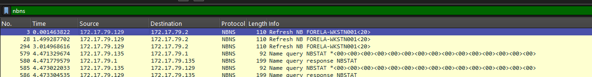
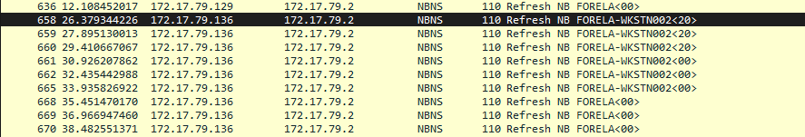
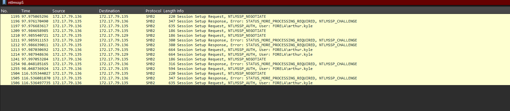
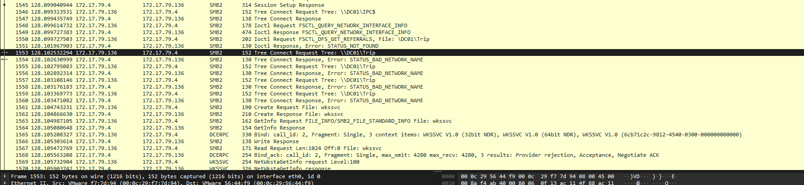
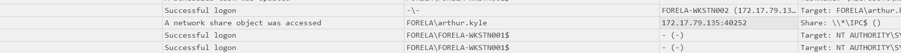
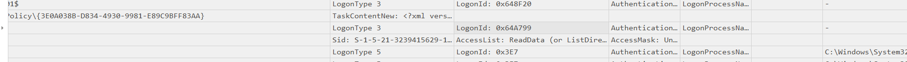
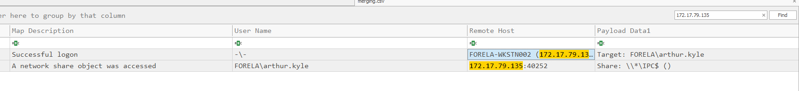

# CrownJewel-2 HTB Writeup

## Summary


SIEM systems alerted us to a mismatch between the IP source and the workstation name.  
We are given a `.pcap` file and an `.evtx` file.

---

## 🗂️ Step 1 – Download and Extract

```bash
wget [link-to-file]
```

Password: `hacktheblue`

There’s no README included, so we proceed directly to analysis.

---

## Step 2 – Provided Files

- `ntmlrelay.pcapng` – We will use Wireshark to analyze this file.  
- `security.evtx` – We will use Timeline Explorer to analyze this file.

---

## Step 3: Analyzing `.evtx`

We use **EvtxECmd** to convert all `.evtx` files into a consolidated CSV file, which we’ll explore with **Timeline Explorer**

```bash
.\EvtxECmd.exe -d "path-to-folder" --csv "path-to-output" --csvf merging.csv
```

---


### T1 – What is the IP Address for Forela-Wkstn001?

Filter for NBNS protocol in Wireshark.  
  
**Answer:** `"172.17.79.129"`

---

### T2 – What is the IP Address for Forela-Wkstn002?

You can use the same method.  
  
**Answer:** `"172.17.79.136"`

---

### T3 – What is the username of the account whose hash was stolen by the attacker?

Filter with `ntlmssp` in Wireshark.  
  
**Answer:** `"arthur.kyle"`

---

### T4 – What is the IP Address of the unknown device used by the attacker to intercept credentials?

From the previous question, we identify the attacker's login attempt by source IP.  
**Answer:** `"172.17.79.135"`

---

### T5 – What was the file share navigated by the victim user account?

Filter for `SMB2`.  
  
**Answer:** `"\\DC01\Trip"`

---

### T6 – What is the source port used to log on to the target workstation using the compromised account?

From file explorer logs, and by assumption from the previous question.  
  
**Answer:** `"40252"`

---

### T7 – What is the Logon ID for the malicious session?

Scroll through the logs to find the Logon ID.  
  
**Answer:** `"0x64A799"`

---

### T8 – The detection was based on the mismatch of hostname and the assigned IP Address. What is the workstation name and the source IP Address from which the malicious logon occurred?

Filter using the IP:Port combination.  
  
**Answer:** `"FORELA-WKSTN002, 172.17.79.135"`

---

### T9 – At what UTC time did the malicious logon happen?

**Answer:** `"2024-07-31 04:55:16"`

---

### T10 – What is the share name accessed as part of the authentication process by the malicious tool used by the attacker?

**Answer:** `"\\*\IPC$"`