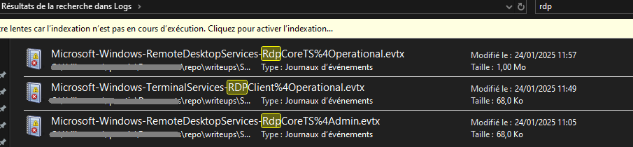
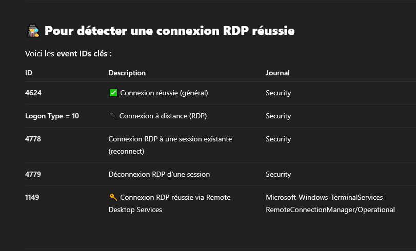
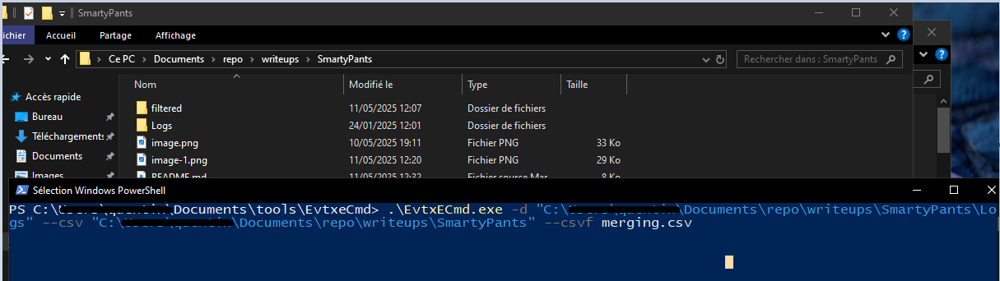
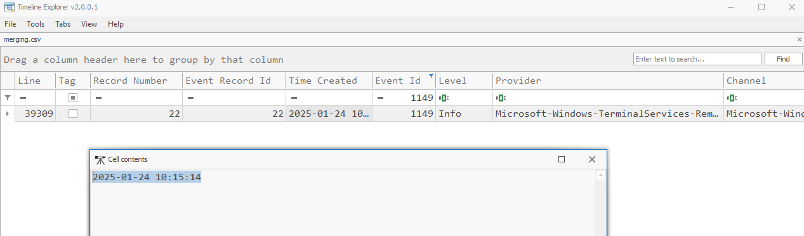
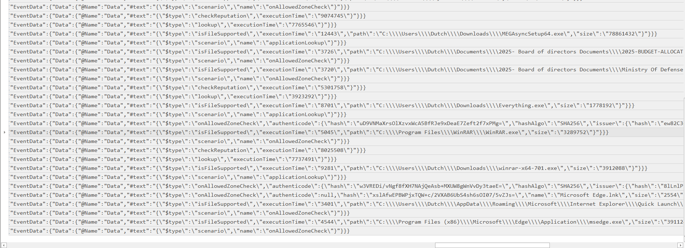
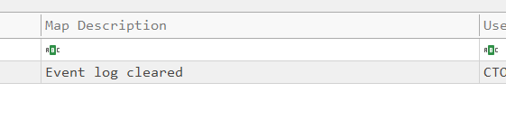

# SmartyPants HTB Writeup

In this challenge, an attacker accessed internal data. To lead investigations, a PCAP file is provided.

## Summary

We are informed that:
- Forela stores data in separate Windows systems.
- On 24 Jan 2025, an intruder accessed the fileserver via RDP.
- The attacker injected and extracted critical files.
- Files were deleted and a ransomware note was left.
- SmartScreen Debug is available to access logs.

---
## Step 1: Download and Unpack

Download the provided archive:

```
wget [link-to-the-file]
```

Password: `hacktheblue`

Note: There is no README file inside, so we move directly to log analysis.

---

## Step 2: Provided Files


An enormous number of `.evtx` files are provided. These are Windows Event Log files used for journaling.

A helpful Reddit post suggests using the built-in Windows Event Viewer:  
https://www.reddit.com/r/hacking/comments/t9jh6h/evtx_files/

---

## Step 3: Analyzing

Faced with many files, we need to filter the logs based on:
- Date: 24 Jan 2025
- Login/RDP activities
- SmartScreen activities



After research, we identified important Event IDs to filter the logs efficiently.



As manually reviewing each log would be tedious, we convert all `.evtx` files to CSV or JSON using **EvtxECmd**:  
https://ericzimmerman.github.io/#!index.md  
Tool documentation: https://github.com/EricZimmerman/evtx





To analyze these CSVs visually, we use **Timeline Explorer**.

Filtering by relevant Event IDs, we find:
- A remote connection occurred.
- WinRAR was downloaded via SmartScreen.




filtering by time and just by scrolling we can answer pretty much easily to last question.
To answer the last one you must check for id of event log related to cleared event log.




## Final Notes

This investigation demonstrates:
- The critical importance of structured log analysis in identifying and tracing unauthorized access.
- The value of using purpose-built tools (like EvtxECmd and Timeline Explorer) for working with Windows Event Logs.
- The need to closely monitor RDP and SmartScreen activities, especially on systems with sensitive data.


